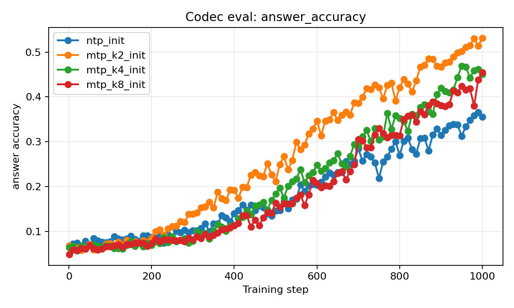
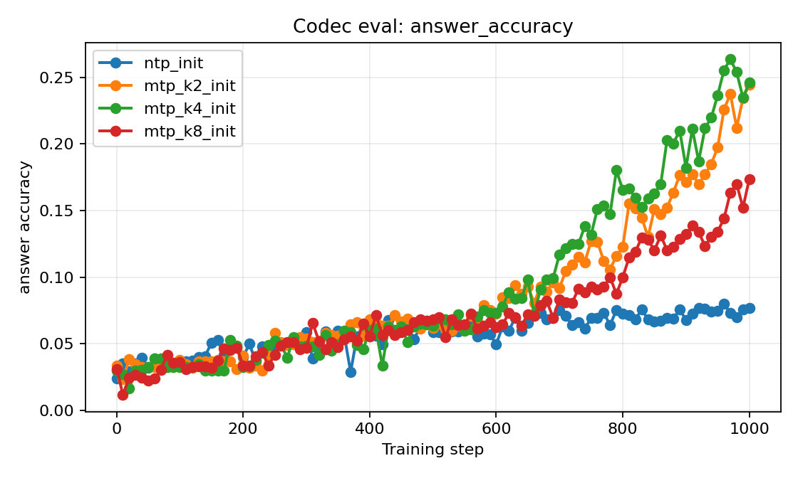
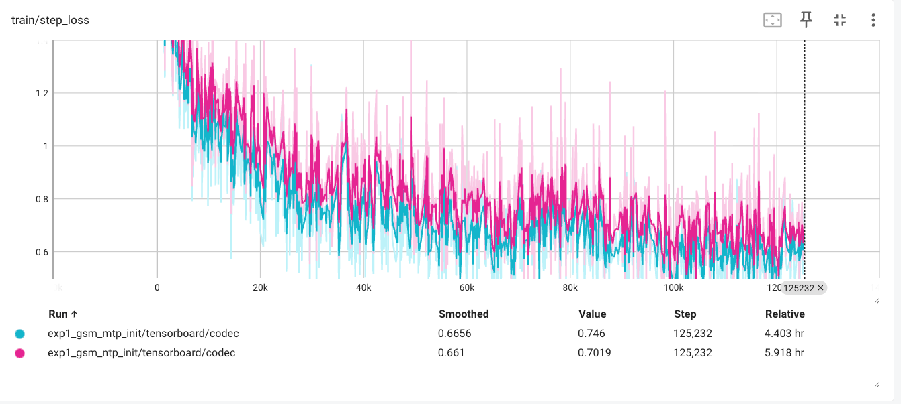
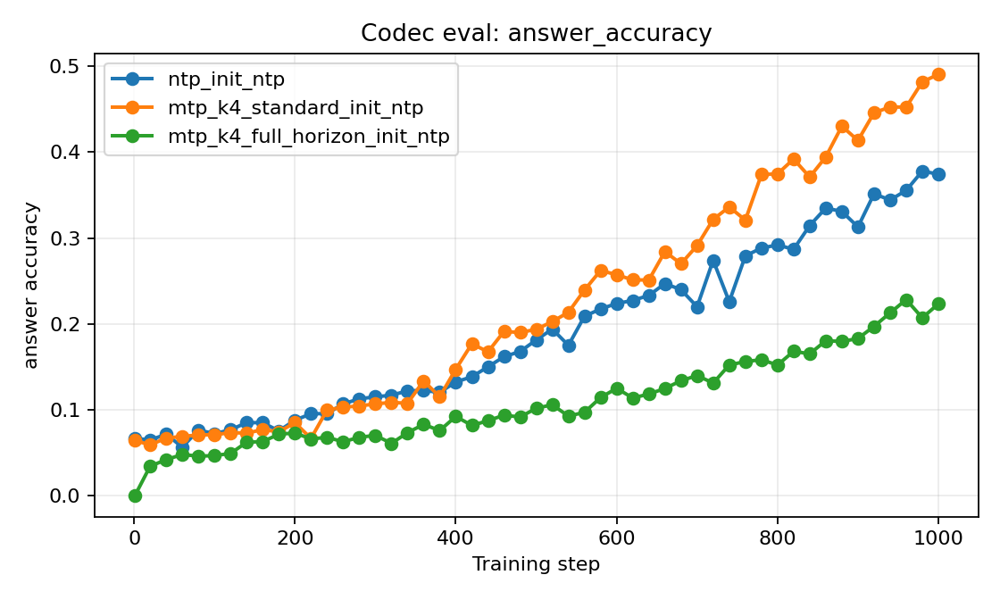
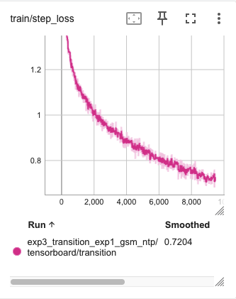
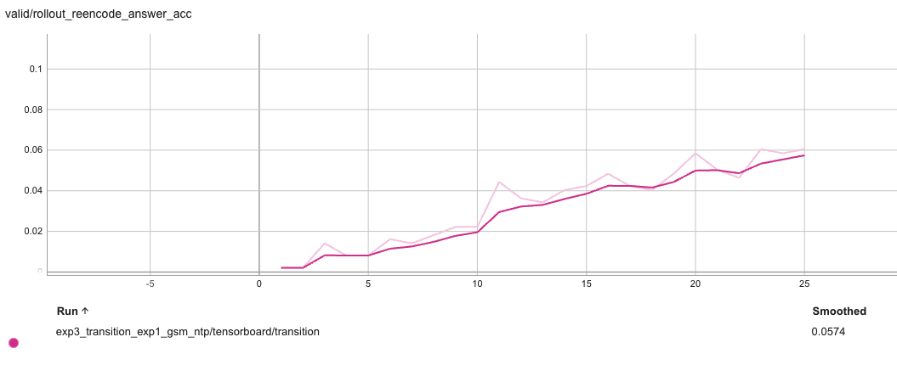

# MTP 与 Sentence-level Latent Reasoning 实验设计文档

## 0. 文档目的

本文档用于指导后续实现与实验，不讨论具体代码结构。目标是把 MTP 在 sentence-level latent reasoning 系统中的可能作用拆干净，避免再次混淆以下几件事：

1. MTP hidden state 是否包含更多 future information；
2. MTP 是否让 sentence embedding encoder-decoder 更容易训练；
3. MTP 是否让训练完成后的 latent representation 更适合 transition model；
4. MTP 是否更适合作为 latent transition model 的初始化；
5. MTP 的收益是否主要体现在 low-data、fixed-compute 或 cross-task transfer 场景。

本文档中的实验设计只回答“要做哪些实验、每个实验的假设是什么、预期是什么、观察什么指标”。具体实现方式由 Codex 根据项目代码结构决定。

---

## 1. 已有结论与问题重定义

### 1.1 当前已有结论

最初的问题是：

> Multi-token prediction, MTP，相比 next-token prediction, NTP，是否能帮助模型学到更长程的信息，并进一步改善 latent reasoning？

目前更合理的拆分是：

> MTP 首先可能增强的是 **multi-token future information inclusion**，即当前位置 hidden state 是否包含更多未来 token、span 或 reasoning step 的语义、结构、表层续写信息。

但 latent reasoning 需要的不只是“信息存在于 hidden state 中”，还需要这些信息满足：

1. **判别性**：能区分正确下一步，而不是只编码所有候选共享的格式或续写形态；
2. **self-usable**：能被模型自身的 attention、MLP、LM head 或 latent rollout 机制使用，而不只是被外部 probe 读出；
3. **可递推性**：作为 latent state 多步 rollout 时不快速漂移或崩溃；
4. **任务匹配性**：任务需要的是语义 continuation/search state，还是精确变量绑定、算术、符号状态。

已有实验大致支持以下判断：

> MTP 确实倾向于增强 hidden state 中的 future continuation information；但这些信息是否转化为 latent reasoning 收益，取决于它们是否是任务需要的、具有判别性的、self-usable 的、可递推的 reasoning-state 信息。

这解释了当前看似矛盾的结果：

- 在 GSM8K prefix-conditioned next-step retrieval 中，MTP 在 bilinear probe 下优于 NTP，说明 MTP hidden state 中存在更多可被外部读出的未来 step 信息。
- 但 raw cosine 下 MTP 不如 NTP，说明这些信息不一定天然形成更好的 raw alignment 或判别 margin。
- 在 GSM8K coconut-style latent reasoning 后训练中，NTP 反而优于 MTP，说明 MTP 的 future information 没有自然转化为精确算术 reasoning state。
- 在 ProsQA 上，MTP 与 NTP 接近甚至略优，说明 MTP 不是普遍损害 latent-style 后训练，而是任务类型会调节它是否有益。

因此，研究问题不应再写成：

> MTP checkpoint 直接做 Coconut 是否比 NTP checkpoint 好？

而应写成：

> MTP 是否作为 initialization 或 training objective，让模型更容易学出适合 latent reasoning 的 sentence-level predictive representation 和 latent transition dynamics？

---

## 2. 参考工作的必要基础知识

### 2.1 Coconut 的关键机制

Coconut 的核心机制是：模型在 language mode 和 latent mode 之间切换。在 latent mode 中，模型不把 last hidden state 解码成 token，而是把 last hidden state 直接作为下一步 input embedding 继续喂回模型。这个 last hidden state 被称为 continuous thought。

Coconut 的重要启发是：

1. latent state 可以不通过自然语言 token 表达推理过程；
2. continuous thought 有可能编码多个潜在下一步，形成类似 breadth-first search 的行为；
3. 但 Coconut 的方式依赖模型自身 hidden state 与后续 forward 之间的接口兼容性；
4. 原始 hidden state 是否 self-usable 是一个关键问题。

这对我们的问题很重要：之前直接把 MTP checkpoint 放进 coconut-style 训练，其实同时改变了 representation、模型本体、rollout 接口和优化动态，无法单独判断 MTP representation 是否有用。

### 2.2 Sentence embedding latent reasoning 的关键机制

Latent Reasoning via Sentence Embedding Prediction 的关键启发不是“我们要复现它”，而是它把 latent reasoning 拆成了更清楚的模块：

1. **sentence-level codec**：把一个句子、step 或上下文压成 continuous embedding，并可由 decoder 读回文本；
2. **latent model / transition model**：在 embedding space 中预测下一步 embedding；
3. **inference mode**：可以是 discretized rollout，也可以是 continuous rollout。

该工作区分了两类 embedding：

- **semantic embedding**：通过 reconstruction objective 学到，目标是保留当前句子的表层和语义内容；
- **contextual embedding**：通过 next-sentence prediction 学到，目标是编码当前上下文对下一步的预测性结构。

对我们的启发是：latent reasoning 需要的更可能是 contextual / predictive state，而不是单纯 reconstruct 当前 step 的 semantic state。

### 2.3 为什么不能简单把 MTP 加到 sentence embedding paper 里

如果我们完整训练一个 sentence embedding encoder-decoder，那么这个系统本身已经可以通过 next-sentence objective 学出 predictive embedding。此时 MTP 的作用不应该被定义为“直接提供最终 representation”，而更应该被定义为：

> MTP 是否让 sentence-level codec 更好、更快、更省数据地学出 predictive embedding？

也就是说，MTP 的合理位置是：

1. codec 的 initialization；
2. codec training objective 的 multi-horizon 变体；
3. latent transition model 的 initialization；
4. cross-task transfer 的 inductive bias。

---

## 3. 总体实验逻辑

整个研究分为四个实验层次：

1. **Codec training 实验**：MTP initialization 或 MTP-style objective 是否让 sentence-level codec 更好学；
2. **Codec latent quality 实验**：训练完成后的 latent representation 是否更具判别性、更适合推理；
3. **Latent transition 实验**：不同 codec 产生的 latent space 是否更容易学习状态转移；
4. **Transfer 实验**：MTP 的收益是否主要出现在低数据、固定计算量或跨任务迁移中。

最重要的原则：

> 不要只比较 MTP-all vs NTP-all。必须拆成 codec initialization、codec objective、transition initialization 和 transfer 四个轴。

---

## 4. 统一数据形式

每条数据都应整理成 reasoning trace：

```text
question
s_1
s_2
...
s_n
answer
```

其中 `s_i` 是一个 reasoning step。

统一构造 prefix-target pair：

```text
x_i = question + s_1 + ... + s_{i-1}
target_1 = s_i
target_2 = s_{i+1}
target_3 = s_{i+2}
...
```

如果某个 horizon 超出 trace 长度，则该 horizon 的 loss 和指标应 mask 掉。

优先任务：

1. **ProsQA**：主任务。它更接近 search / planning / semantic reasoning，是最可能体现 MTP predictive prior 的任务；
2. **Blocksworld**：状态转移和规划任务，适合观察 latent transition；
3. **GSM8K**：精确变量绑定和算术压力测试，不应作为唯一主战场。

---

## 5. 实验一：MTP initialization 是否让 codec 更好学

### 5.1 假设

MTP pretraining 让模型更倾向于编码未来 continuation 信息，因此用 MTP checkpoint 初始化 sentence-level predictive codec，可能比 NTP checkpoint 初始化更快收敛、更省数据，或者最终学到更适合 latent transition 的 representation。

### 5.2 实验设置

训练两个 codec：

```text
Codec-NTP-init
Codec-MTP-init
```

二者保持：

- 相同模型结构；
- 相同训练数据；
- 相同 objective；
- 相同训练步数；
- 相同超参数预算；
- 只改变 initialization 来源。

这里的 codec 是 encoder-decoder model：

```text
Encoder(x_i) -> z_i
Decoder(z_i) -> s_i
```

其中 `x_i = question + previous steps`，`s_i` 是当前 step。

### 5.3 需要比较的条件

基础条件：

```text
A1: NTP-init codec + standard NTP codec objective
A2: MTP-init codec + standard NTP codec objective
```

### 5.4 观察指标

训练过程指标：

- train loss curve；
- validation loss curve；
- fixed-step performance，例如早期、中期、后期 checkpoints；
- sample efficiency：不同训练数据比例下的表现；
- convergence speed：达到同一 validation loss 或同一 generation accuracy 所需步数。

codec 输出质量：

- next-step generation accuracy；
- token-level F1 或相似指标；
- final answer accuracy，如果 decoder 输出可直接评估；
- latent norm 和分布稳定性。

后续关键指标：

- 训练完成后 latent space 是否更容易被 transition model 建模；
- latent rollout 是否更稳定。

### 5.5 预期结果与解释

如果 MTP-init 只在早期更好，最终与 NTP-init 持平：

> MTP 主要提供 optimization warm start。

如果 MTP-init 在充分训练后仍然更好：

> MTP initialization 可能把 codec 带入了更好的 representation basin。

如果 MTP-init 在 codec CE 上没有优势，但后续 transition 更好：

> MTP 的价值可能不在于更好地 reconstruct/predict text，而在于塑造更容易学习 latent dynamics 的 representation geometry。

如果 MTP-init 全面无优势：

> 在该 codec objective 和该任务上，MTP initialization 不是有效增量。

### 实验结果
#### 合成数据集




#### 真实数据集
还没训完，部分结果


初步结论：
mtp init model在作为表征生成器这一步上的效果比ntp略好

解释：


---

## 6. 实验二：codec objective 从 NTP 改成 MTP 是否有收益

### 6.1 背景

标准 codec 训练虽然是 sentence-level prediction，但 decoder 内部仍然是 token-level NTP：

```text
Decoder(z_i) autoregressively predicts s_i token by token
```

因此可以问：如果 codec 训练本身也引入 MTP-style multi-horizon supervision，是否能让 latent state 更适合 reasoning？

这里需要严格区分两类 MTP objective：

1. **decoder token-level MTP**：在 decoder token generation 内部预测多个未来 token；
2. **step-level MTP**：从同一个 `z_i` 预测多个未来 reasoning steps。

我们更关注 step-level MTP，因为 latent reasoning 需要的是 reasoning-step-level predictive state，而不是只提升 decoder 的局部语言建模。

---

### 6.2 实验二 A：decoder token-level MTP objective

#### 假设

decoder token-level MTP 可能提升 decoder 的局部语言建模和目标 step 生成质量，但不一定改善 latent representation 的可递推性。

#### 实验设置

比较：

```text
A1: NTP-init + standard NTP codec objective
B1: NTP-init + decoder token-level MTP codec objective
A2: MTP-init + standard NTP codec objective
B2: MTP-init + decoder token-level MTP codec objective
```

核心对照：

```text
B1 vs A1: objective 本身是否有收益
B2 vs A2: 在 MTP initialization 下，token-level MTP objective 是否进一步有收益
B2 vs B1: 在 token-level MTP objective 下，MTP initialization 是否仍有额外收益
```

#### 观察指标

codec 层面：

- decoder CE；
- next-step generation quality；
- horizon 内 token prediction 指标。

latent reasoning 层面：

- next-step latent retrieval；
- transition model 的 single-step 和 multi-step 表现；
- continuous rollout stability；
- final answer accuracy。

#### 预期结果

如果 decoder token-level MTP 降低 CE，但 transition/rollout 没改善：

> 它主要改善 decoder 语言建模，而不是 latent reasoning state。

如果 decoder token-level MTP 同时改善 transition 和 rollout：

> token-level multi-horizon supervision 可能间接改善了 `z_i` 的 predictive content，但需要进一步确认是否只是表层 continuation 信息。

如果它在 GSM8K 上伤害 transition：

> 可能是强化了公式格式、数字模板等 shared surface-form directions，而不是精确 reasoning state。

---

### 6.3 实验二 B：step-level MTP objective

#### 假设

step-level MTP 更可能让 `z_i` 编码未来多步 reasoning trajectory，因此比 decoder token-level MTP 更可能改善 latent transition 和 planning/search 类任务。

#### 实验设置

从同一个 prefix representation `z_i` 预测多个未来 reasoning steps：

```text
z_i -> s_i
z_i -> s_{i+1}
z_i -> s_{i+2}
```

比较：

```text
A1: NTP-init + standard NTP codec objective
C1: NTP-init + step-level MTP codec objective
A2: MTP-init + standard NTP codec objective
C2: MTP-init + step-level MTP codec objective
```

核心对照：

```text
C1 vs A1: step-level MTP objective 是否有用
C2 vs A2: step-level MTP objective 是否增强 MTP-init codec
C2 vs C1: step-level MTP objective 下，MTP initialization 是否仍有额外收益
C2 vs A1: 最强组合是否优于 baseline
```

#### 观察指标

codec 层面：

- horizon-1 step prediction quality；
- horizon-2 / horizon-3 step prediction quality；
- 不同 horizon 的 CE 或 generation 指标；
- latent norm 和分布稳定性。

latent quality 层面：

- `z_i` 对 `s_i` 的 retrieval；
- `z_i` 对 `s_{i+1}`、`s_{i+2}` 的 retrieval；
- positive score、max negative score、margin；
- 按 negative 类型分解的 margin。

transition 层面：

- `z_i -> z_{i+1}` 是否更容易学；
- multi-step rollout 是否更稳定；
- rollout 后 decoder 是否仍能读出合理 step；
- final answer accuracy。

#### 预期结果

如果 step-level MTP 在 ProsQA / Blocksworld 上改善 transition 和 rollout：

> multi-step reasoning supervision 确实让 codec 学到更适合 search/planning 的 predictive latent state。

如果 step-level MTP 只改善 horizon-2/horizon-3 generation，但不改善 transition：

> `z_i` 可能变成了 future text summary，而不是 clean reasoning state。

如果 step-level MTP 在 GSM8K 上不稳定或变差：

> 它可能强化了表层公式模板，而不是精确变量绑定和算术状态。

如果 C2 明显优于 C1：

> MTP initialization 与 step-level MTP objective 有互补。

如果 C1 已经明显优于 A1，而 C2 没有进一步提升：

> 收益主要来自下游 step-level objective，而不是 MTP pretraining initialization。

---

## 6-5 transition model的实现




目前transition model可以完成学习，并且有一定效果。

接下来要做ntp和mtp的对比，并做结果分析


## 7. 实验三：训练完成后的 codec latent space 是否更适合 transition

### 7.1 假设

即使不同 codec 的 next-step generation CE 接近，它们学到的 latent geometry 也可能不同。MTP-init codec 或 step-level MTP codec 可能产生更容易建模的 latent dynamics。

### 7.2 实验设置

先训练并冻结以下 codec：

```text
A1: NTP-init + standard NTP codec objective
A2: MTP-init + standard NTP codec objective
C1: NTP-init + step-level MTP codec objective
C2: MTP-init + step-level MTP codec objective
```

对每个 codec 抽取 latent trajectory：

```text
z_i = Encoder(question + s_1 + ... + s_{i-1})
z_{i+1} = Encoder(question + s_1 + ... + s_i)
```

训练相同结构、相同预算的 transition model：

```text
T(z_i) -> z_{i+1}
```

### 7.3 观察指标

single-step transition：

- next-state retrieval accuracy；
- MRR；
- positive score；
- max negative score；
- margin；
- normalized distance 或相似指标。

multi-step rollout：

- rollout 到第 t 步后 retrieve true `z_t` 的能力；
- latent norm drift；
- latent distribution drift；
- rollout state 是否仍在 decoder-readable manifold；
- decoded step 的 validity；
- final answer accuracy。

### 7.4 预期结果与解释

如果 A2 比 A1 更容易 transition：

> MTP initialization 训练出的 codec latent space 更适合 dynamics modeling。

如果 C1 比 A1 更容易 transition：

> step-level MTP objective 改善了 latent dynamics。

如果 C2 最好：

> MTP initialization 与 step-level MTP objective 可能叠加。

如果 codec CE 相近但 transition 差异明显：

> codec 的文本预测质量不足以衡量 latent reasoning 质量；latent geometry 是独立关键因素。

如果所有 codec 的 single-step transition 都好，但 multi-step rollout 差：

> 问题主要在递推稳定性，而不是单步 transition。

---

## 8. 实验四：MTP 是否更适合初始化 latent transition model

### 8.1 假设

MTP pretraining 的 future-predictive inductive bias 不一定只体现在 codec 上，也可能让 transition model 更适合学习 latent dynamics。

### 8.2 实验设置

固定同一个 codec latent space，比较 transition model initialization：

```text
random init
NTP init
MTP init
```

需要在多个 codec latent space 上重复：

```text
A1 latent space
A2 latent space
C1 latent space
C2 latent space
```

核心比较：

```text
固定 codec，看 transition init:
MTP transition init vs NTP transition init vs random

固定 transition init，看 codec:
A2 vs A1
C2 vs C1
C1 vs A1
C2 vs A2
```

### 8.3 观察指标

训练效率：

- transition loss curve；
- fixed-step single-step retrieval；
- 达到同等 validation transition performance 所需步数。

最终效果：

- single-step next-state retrieval；
- multi-step rollout stability；
- decoder-readable manifold preservation；
- final answer accuracy。

### 8.4 预期结果与解释

如果 MTP transition init 在固定 codec 下更快或更好：

> MTP pretraining 可能给 transition model 提供了有用的 future-predictive dynamics prior。

如果 random init 与 MTP/NTP init 差不多：

> transition model 的收益主要来自 codec latent space，而不是 LM pretraining initialization。

如果只有 MTP codec + MTP transition 组合最好：

> 可能存在 MTP-induced latent interface compatibility，但这个结论较难解释，需要谨慎。

---

## 9. 实验五：continuous rollout vs discretized rollout

### 9.1 假设

一个 codec/transition 组合可能在 discretized rollout 下表现好，但在 continuous rollout 下崩溃。这说明它能通过文本 manifold 修正误差，但 latent state 本身不可稳定递推。

### 9.2 实验设置

对前面表现较好的 codec + transition 组合，比较两种 inference：

**Continuous rollout**：

```text
z_{t+1} = T(z_t)
```

**Discretized rollout**：

```text
z_t -> Decoder -> text step
text step appended to prefix
Encoder(new prefix) -> z_{t+1}
```

### 9.3 观察指标

- step-level validity；
- final answer accuracy；
- rollout drift；
- compute cost；
- continuous 与 discretized 的性能差距；
- 不同 rollout horizon 下的退化速度。

### 9.4 预期结果与解释

如果 discretized 好、continuous 差：

> codec/readout 有用，但 latent transition 不稳定。

如果 continuous 也好：

> learned latent space 更接近真正可递推的 reasoning state。

如果 ProsQA / Blocksworld 上 continuous 好，GSM8K 上差：

> learned latent 更适合 semantic continuation/search/planning，不适合精确算术变量绑定。

---

## 10. 实验六：跨任务迁移

### 10.1 假设

如果单任务数据充足、训练充分，MTP 的优势可能被下游训练洗掉。MTP 更可能体现价值的地方是 low-data、fixed-compute 和 cross-task transfer。

### 10.2 Codec transfer

训练 codec 于任务 A，在任务 B 上评估或少量 finetune：

```text
ProsQA -> Blocksworld
Blocksworld -> ProsQA
general CoT corpus -> ProsQA
general CoT corpus -> GSM8K
```

比较：

```text
NTP-init + standard objective
MTP-init + standard objective
NTP-init + step-level MTP objective
MTP-init + step-level MTP objective
```

### 10.3 Transition transfer

训练 codec 和 transition 于任务 A，然后在任务 B 上少量适配 transition 或整个 latent reasoning pipeline。

比较：

- adaptation speed；
- few-shot transition retrieval；
- few-shot rollout answer accuracy；
- OOD stability；
- 不同数据比例下的性能曲线。

### 10.4 预期结果与解释

如果 MTP 只在 low-data / transfer 下有优势：

> MTP 的主要价值是通用 future-predictive prior，而不是单任务充分训练后的 asymptotic performance。

如果 MTP 在 transfer 中也没有优势：

> 在当前任务和 codec 设计下，MTP 对 sentence-level latent reasoning 的贡献有限。

如果 step-level MTP objective 比 MTP initialization 更重要：

> 下游 multi-horizon supervision 比上游 MTP pretraining 更直接地塑造了可迁移 latent state。

---

## 11. 推荐实验优先级

### 第一优先级：ProsQA 上的最小主线

先做以下四个 codec：

```text
A1: NTP-init + standard NTP codec objective
A2: MTP-init + standard NTP codec objective
C1: NTP-init + step-level MTP codec objective
C2: MTP-init + step-level MTP codec objective
```

观察：

- codec learning curve；
- next-step / multi-step generation；
- latent retrieval margin；
- frozen codec 后的 transition learning；
- continuous rollout with oracle step count。

### 第二优先级：Blocksworld 复验

目的：验证 ProsQA 结果是否能迁移到规划/状态转移任务。

重点观察：

- transition stability；
- continuous rollout；
- state validity。

### 第三优先级：GSM8K 压力测试

目的：判断 MTP / step-level MTP 是否在精确变量绑定任务上失败。

重点观察：

- number preservation；
- operator correctness；
- equation validity；
- shared surface-form directions 是否压低 margin。

### 第四优先级：decoder token-level MTP ablation

目的：确认普通 token-level MTP 是否只是改善 decoder language modeling，而非 latent reasoning state。

### 第五优先级：cross-task transfer

目的：测试 MTP 是否主要贡献于 sample efficiency 和 transfer。

---

## 12. 结果解释总表

| 观察结果 | 解释 |
|---|---|
| MTP-init codec 早期更好，最终持平 | MTP 主要是 optimization warm start |
| MTP-init codec 最终也更好 | MTP 可能引导 codec 到更好的 representation basin |
| step-level MTP objective 明显优于 standard objective | multi-horizon reasoning-step supervision 改善 latent state |
| decoder token-level MTP 降低 CE，但 transition/rollout 没改善 | 它主要改善 decoder 语言建模，不改善 latent reasoning state |
| codec CE 接近，但 transition 表现差异大 | 文本预测质量不足以衡量 latent reasoning 质量 |
| MTP transition init 在固定 codec 下更好 | MTP 给 transition model 提供 dynamics prior |
| 只有 ProsQA/Blocksworld 有收益，GSM8K 无收益 | MTP 更适合 search/planning/semantic continuation，不适合精确算术状态 |
| 只有 low-data / transfer 有收益 | MTP 的主要价值是通用 future-predictive prior |
| 所有条件下 MTP 都无优势 | sentence embedding codec 已经吸收了所需 predictive structure，MTP 在当前设定下冗余 |

---

## 13. 最终研究主线表述

本文档建议的研究主线是：

> MTP 的潜在价值不应被理解为“直接把 MTP checkpoint 放进 Coconut 就会更好”，而应被理解为：MTP 作为一种 future-predictive pretraining signal，是否能帮助模型更快、更省数据、更稳定地学出 sentence-level predictive codec，以及更容易学习 latent transition dynamics。

最关键的实验结论应来自三个比较：

1. **MTP-init codec vs NTP-init codec**：检验 initialization；
2. **step-level MTP objective vs standard NTP codec objective**：检验下游 multi-horizon supervision；
3. **MTP transition init vs NTP/random transition init**：检验 latent dynamics prior。

最终要回答的不是“MTP 是否包含未来信息”，而是：

> MTP 增强的 future-predictive bias，能否通过合适的 codec objective 和 transition training，转化为判别性、self-usable、可递推、可迁移的 latent reasoning state？
